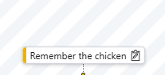
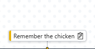
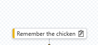
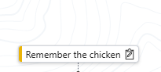

<div align="center">
    
    
    <br/>
    <h1 style="font-size: 248px;">Horizontal Timeline</h1>
    <a href="https://www.buymeacoffee.com/VishwaGauravIn" target="_blank"></a>
</div>
<br/>

# 👋 Introductions

The Horizontal Timeline is a generic custom control built on the Power Apps component framework (PCF).
It is built as an alternative to the classic Vertical Timeline by Microsoft, that I've found very confusing to navigate.

Hopefully you'll find it useful.

# ⚙️ Features & Configuration
### Localization
The custom control support following languagecodes at the moment

> [!IMPORTANT]
> Version 1.0.0 uses the <b>BCP 47 codes</b>, while ≥ 1.1.0 uses <b>LCID Language Codes</b>. Below shows the LCID Language Codes for the supported languages.

<div> 1033 <b>[default]</b></div>
<div> 1030</div>
<div> 1036</div>
<div> 1034</div>
<div>
1031</div>
<div> 2052</div>
<div> 1041</div>
<div> 1025</div>
<div> 1046</div>
<div> 1040</div>
<div> 1081</div>
<div> 1043</div>
<div> 1053</div>
<div> 1035</div>

---

### Locale Source
The language of the control can be set in different ways. Supported methods are:

> [!IMPORTANT]
> This is only supported in Version <b>≥ 1.1.0</b>

- browser (the browser language)
- systemuser <b>[default]</b> (the personalization setting langauge)
- <s>organisation (the language set by the organisation)</s>
- override (a fixed language on the control)

---

### Time units
The control uses the <a href="https://developer.mozilla.org/en-US/docs/Web/JavaScript/Reference/Global_Objects/Intl/DateTimeFormat">Intl.DateTimeFormat</a> object to enable language-sensitive date and time formatting. The control allows for the following formatting:

> [!INFO]
> There are individual toggles to enable/disable the date information entirely.

> Years
>- full <b>[default]</b> (example = "2025")
>- short (example = "25")

> Quarters
>- prefix <b>[default = empty]</b> (example = "Quarter " -> "Quarter 1")

> Months
>- numeric (example = "1")
>- 2-digit (example = "01")
>- long <b>[default]</b> (example = "January")
>- short (example = "Jan")
>- narrow (example = "J")

> Weeks
>- prefix <b>[default = empty]</b> (example = "W" -> "W1")

> Days
>- numeric (example = "1")
>- 2-digit <b>[default]</b> (example = "01")
>- long (example = "Monday")
>- short (example = "Mon")
- narrow (example = "M")

> Hours
>- numeric (example = "1")
>- 2-digit <b>[default]</b> (example = "01")

> Hour Cycle
>- h11 (example = "01PM")
>- h12 (example = "01PM")
>- h23 <b>[default]</b> (example = "13")
>- h24 (example = "13")

---

### Timezone Source

> [!IMPORTANT]
> This is only supported in Version <b>≥ 1.1.0</b>

To control what timezone dates are shown in, you can base it on either:

> [!TIP]
> Examples of the <a href="https://nodatime.org/TimeZones">IANA Time Zone Database</a> formats:
> - America/Santiago
> - Europe/Copenhagen

- browser <b>[default]</b> (based on user's browser timezone)
- override (a fixed timezone set on the control in the IANA Time Zone Database)

---

### Custom table support
When configuring the control you can give a json-formatted string that will describe supported tables.

> [!IMPORTANT]
> In version <b>≥ 1.1.0</b> icons were introduced. Icon names are retrieved from <a href="https://fonts.google.com/icons">Google Material Icons</a>.
> The reason for Google's Icons is due to it being a Fontbased library meaning bundle size is reduced when using dynamic icons.

```
{
   "<tablename>": {
     color: "<hex-color>",
     icon: "<icon>"
   }
}
```

> Default
```
{
  "task": {
    "color": "#eab308",
    "icon": "assignment_turned_in"
  },
  "appointment": {
    "color": "#7e22ce",
    "icon": "calendar_month"
  },
  "milestone": {
    "color": "#e11d48",
    "icon": ""
  },
  "email": {
    "color": "#16a34a",
    "icon": "mail"
  },
  "phonecall": {
    "color": "#fb7185",
    "icon": "call"
  }
}
```

---

### Custom milestones
Milestones are dates on your record, that you wish to see on the timeline. You can define a json-formatted string that will describe the dates put into the timeline. Note that if the column schemaname is incorrect, the milestone is not shown - without any errors/warnings.

```
{
  "<column-schemaname>": "<display name>"
}
```

> Default
```
{
  "createdon": "Created On",
  "estimatedclosedate": "Estimated Close",
  "actualclose": "Actual Close"
}
```

---

### Custom scaling
You can adjust the smallest unit's size (an hour) on the timeline. All other date elements will follow this sizing.
Example: if set to 1 (minimum size) -> a day will become 24px in width -> a week will become 24px\*7=188px in width.

> [!TIP]
> If the value is set to 1 (the minimum size), then a day would become 24 pixels in width. A week would become `24 * 7 = 188` pixels in width.

<b>default = 4</b>

---

### Filter
Inside the filter you have the following options:

- Filter by display name (text search)
- Filter by activitytype (chip toggles)
- Filter by date-interval (date picker)
- Filter by owner (lookup)

---

### Timeless items
You can also see items that do not have any due date (scheduledend). These items will show in a side pane when opened via the actionbar.

---

### Background Style & Colors

The background of the timeline items is customizable. There are a few default options and then an override functionality.
> [!IMPORTANT]
> In version <b>≥ 1.1.0</b>

- stripes


- dots



- grid <b>[default]</b>



- topography



- override

> [!TIP]
> When using override the bgcolor becomes the input field for custom css backgroundimage information. Example: `url("data:image/svg+xml,%3Csvg width='40' height='40' viewBox='0 0 40 40' xmlns='http://www.w3.org/2000/svg'%3E%3Cg fill='#eab308' fill-opacity='0.4' fill-rule='evenodd'%3E%3Cpath d='M0 40L40 0H20L0 20M40 40V20L20 40'/%3E%3C/g%3E%3C/svg%3E")`

---

### Smaller features
- Touch support
- Canvas & Custom Page support

# 🏆 Credits:

⌨️ Lucki2g - Developer ⌨️<br>
🦆 Jimmi Henvig - Rubber duck 🦆

# 📋 Road-map:
